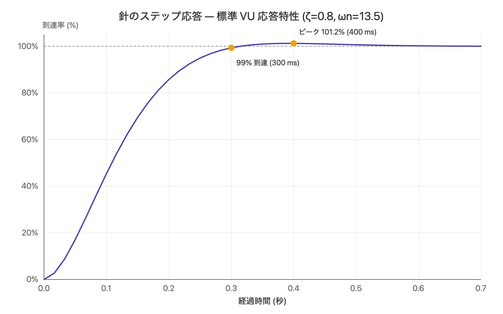

[English](README.md) | [日本語](README.ja.md)

# Audio Meter VU

Mac から出ている音を、本物のアナログ VU メーターで表示するメニューバー常駐アプリです。

**➡️ [Mac App Store でダウンロード](https://apps.apple.com/app/audio-meter-vu/id6785263314)**

> 本リポジトリはこれまで GitHub Releases / Homebrew で Developer ID 署名版を配布していましたが、この配布は終了しました。Audio Meter VU は現在、**Mac App Store のみ**で配布しています。本リポジトリは[プライバシーポリシー](PRIVACY.md)と過去のリリース履歴のために公開を継続しています。

## 特長

- **標準 VU メーターの応答特性** — 針の動きを IEC 60268-17 規格に準拠させています（99% 到達 300ms・オーバーシュート約 1.2%）。デジタルのピークメーターにはない、ゆったりとした音楽的な針の動きです。
- **システムの再生音すべてが対象** — Apple Music / Spotify / YouTube など、Mac のスピーカーから出る音を VU 表示します。Core Audio のプロセスタップを使うため、画面収録のインジケーター（オレンジの点）は出ません。
- **再生に追従（自動スリープ）** — 無音が一定時間続くと自動で消灯して待機し、再生を始めると自動で復帰します。
- **すべてベクター描画** — 文字盤・対数目盛・赤帯・針・照明をコードで描画。クリーム／琥珀色の照明、2 連ステレオ。
- **3 つの表示モード** — 通常 / 常に最前面 / デスクトップに常駐。ウィンドウ位置はディスプレイごとに記憶します。
- **日本語 / 英語対応** — システムの言語に追従（日本語以外の環境では英語表示）。

## 動作環境

- macOS 15 Sequoia 以降
- Apple Silicon（arm64）専用

## 3.0.1 の変更点

- **メモリリークを解消** — macOS 26.5 の SwiftUI 描画エンジンに起因し、メーターを表示し続けるとメモリが増え続ける問題がありました。描画を SwiftUI `Canvas` から AppKit `CALayer` + CoreGraphics へ書き換え、根本的に解消しました。
- **CPU 使用率を大幅に削減** — 文字盤（静的な部分）を背景レイヤーにキャッシュし、針だけを毎フレーム描き直す構成に変更。60fps 時の CPU 使用率が約34% → **約2%** に低下しました。
- **待機中は描画を完全に停止** — 一時停止・自動スリープ・非表示のときは、消灯した文字盤を描き続けるのではなく、再描画そのものを停止します（CPU 使用率 0%）。
- アプリ名を **Audio Meter VU** に統一（About ダイアログ・Dock・メニューすべて）。

## インストール

Mac App Store で配布しています：

**[Audio Meter VU をダウンロード](https://apps.apple.com/app/audio-meter-vu/id6785263314)**

初回起動時に「システムの再生音を取得する」許可を求められます。許可してください（マイクではなく、再生音だけを取得します）。

## 使い方

- メニューバーの波形アイコンから操作します（Dock には表示されません）。
- 「再生に追従（自動スリープ）」を有効にすると、音が鳴っていないときは自動で休み、再生で目を覚まします。
- メーターのウィンドウをクリックすると、計測の停止／再開を切り替えられます。

## 背景

このアプリは、1995 年に PowerPC Mac 向けに作った「AudioMeter 2.0」の現代版リライトです。当時の針の動き（立ち上がりは速く、下降はゆっくり）を、今の技術で標準 VU 規格に合わせて作り直しました。

## データシート

IEC 60268-17 規格準拠 99% 到達 300ms・オーバーシュート約 1.2%

## プライバシー

本アプリはデータを収集せず、インターネット通信も行いません。システム音声はメーターの音量レベル算出のためにのみ読み取り、録音・保存・送信は一切行いません。詳しくは[プライバシーポリシー](PRIVACY.md)をご覧ください。

## ライセンス

Copyright © 1995–2026 EVA Titer. All rights reserved.
