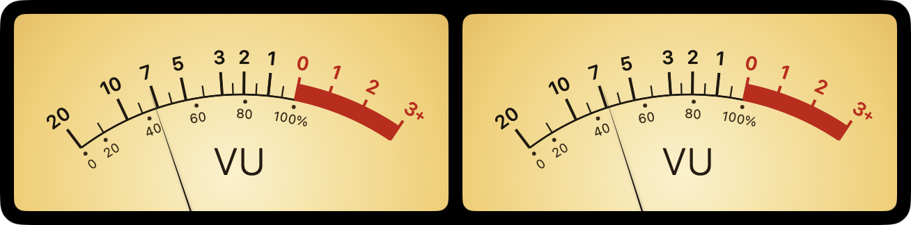

# AudioMeter

Mac から出ている音を、本物のアナログ VU メーターで表示するメニューバー常駐アプリです。

## 特長

- **標準 VU メーターの応答特性** — 針の動きを IEC 60268-17 規格に準拠させています（99% 到達 300ms・オーバーシュート約 1.2%）。デジタルのピークメーターにはない、ゆったりとした音楽的な針の動きです。
- **システムの再生音すべてが対象** — Apple Music / Spotify / YouTube など、Mac のスピーカーから出る音を VU 表示します。Core Audio のプロセスタップを使うため、画面収録のインジケーター（オレンジの点）は出ません。
- **再生に追従（自動スリープ）** — 無音が一定時間続くと自動で消灯して待機し、再生を始めると自動で復帰します。
- **すべてベクター描画** — 文字盤・対数目盛・赤帯・針・照明をコードで描画。クリーム／琥珀色の照明、2 連ステレオ。
- **3 つの表示モード** — 通常 / 常に最前面 / デスクトップに常駐。ウィンドウ位置はディスプレイごとに記憶します。
- **日本語 / 英語対応** — システムの言語に追従（日本語以外の環境では英語表示）。

## 動作環境

- macOS 15 Sequoia 以降
- Apple Silicon（arm64）専用

## インストール

1. [Releases](https://github.com/EVAtiter/audiometer-release/releases) から最新の `AudioMeter-X.Y.Z.zip` をダウンロードします。
2. 展開して `AudioMeter.app` を「アプリケーション」フォルダーへ移動します。
3. 初回起動時に「システムの再生音を取得する」許可を求められます。許可してください（マイクではなく、再生音だけを取得します）。

Developer ID 署名・公証済みのため、ダウンロード後そのまま起動できます。

## 使い方

- メニューバーの波形アイコンから操作します（Dock には表示されません）。
- 「再生に追従（自動スリープ）」を有効にすると、音が鳴っていないときは自動で休み、再生で目を覚まします。
- メーターのウィンドウをクリックすると、計測の停止／再開を切り替えられます。

## 背景

このアプリは、1995 年に PowerPC Mac 向けに作った「AudioMeter 2.0」の現代版リライトです。当時の針の動き（立ち上がりは速く、下降はゆっくり）を、今の技術で標準 VU 規格に合わせて作り直しました。

## ライセンス

Copyright © 1995–2026 EVA Titer. All rights reserved.
