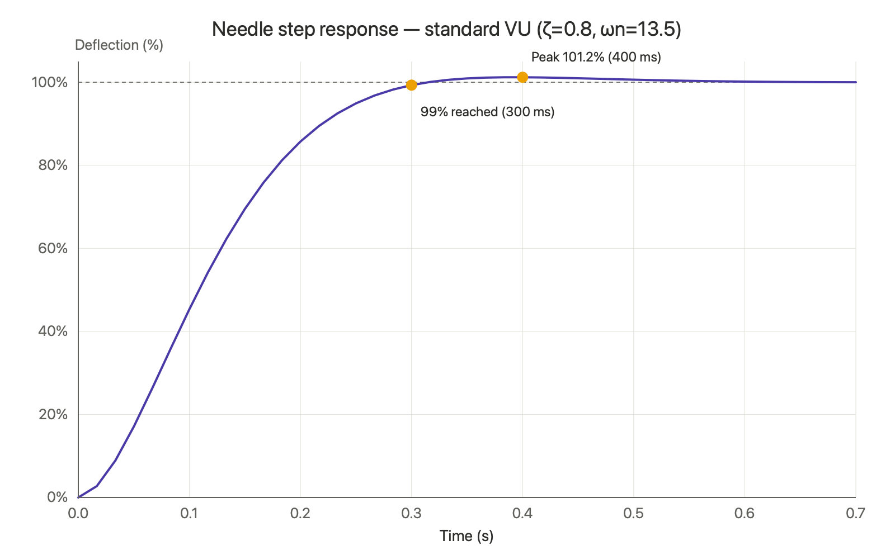

[English](README.md) | [日本語](README.ja.md)

# Audio Meter VU

A menu-bar app that displays your Mac's audio output on a real analog VU meter.

**➡️ [Download on the Mac App Store](https://apps.apple.com/app/audio-meter-vu/id6785263314)**

> This repository previously distributed a Developer ID–signed build via GitHub Releases and Homebrew. That distribution has been discontinued — Audio Meter VU is now available exclusively on the Mac App Store. This repo remains online for the [Privacy Policy](PRIVACY.md) and release history.

## Features

- **Standard VU meter response** — The needle follows the IEC 60268-17 ballistics spec (reaches 99% in ~300 ms with a slight overshoot), moving with the smooth, musical motion of a real mechanical meter rather than the jumpy motion of a digital peak meter.
- **Captures all system audio** — Apple Music, Spotify, YouTube — anything coming from your Mac's speakers is shown on the meters. It uses a Core Audio process tap, so no screen-recording indicator (the orange dot) appears.
- **Follow playback (auto-sleep)** — Dims and rests after a period of silence, and wakes up automatically when playback starts.
- **Fully vector-drawn** — The dial, logarithmic scale, red band, needle, and lighting are all drawn in code. Cream/amber illumination, dual stereo meters.
- **Three display modes** — Normal / Always on Top / Pin to Desktop. Window position is remembered per display.
- **Japanese / English** — Follows the system language (English outside Japanese environments).

## Requirements

- macOS 15 Sequoia or later
- Apple Silicon (arm64) only

## What's new in 3.0.1

- **Fixed a memory leak** — a macOS 26.5 SwiftUI rendering-engine issue caused memory to grow continuously while the meter was displayed. Rendering was rewritten from SwiftUI `Canvas` to AppKit `CALayer` + CoreGraphics, which eliminates it entirely.
- **CPU usage cut dramatically** — the dial face (static) is now cached to a background layer, and only the needle is redrawn each frame. Measured CPU at 60fps dropped from ~34% to **~2%**.
- **Drawing fully stops while idle** — when paused, in auto-sleep, or hidden, the redraw timer stops completely (0% CPU), instead of continuing to draw a dimmed dial in the background.
- Renamed to **Audio Meter VU** consistently across the About dialog, Dock, and menus.

## Installation

Available on the Mac App Store:

**[Download Audio Meter VU](https://apps.apple.com/app/audio-meter-vu/id6785263314)**

On first launch you'll be asked to allow capturing system audio. Please allow it (it captures playback audio only, not the microphone).

## Usage

- Operate it from the waveform icon in the menu bar (it doesn't appear in the Dock).
- With "Follow playback (auto-sleep)" enabled, it rests when there's no sound and wakes on playback.
- Click the meter window to toggle pause / resume.

## Background

This is a modern rewrite of "AudioMeter 2.0," which I originally wrote for PowerPC Macs in 1995. I rebuilt its needle motion (fast attack, slow release) with today's technology, this time matching the standard VU spec.

## Datasheet

Compliant with IEC 60268-17 — reaches 99% in 300 ms, overshoot approx. 1.2%

## Privacy

The app collects no data and does not communicate over the internet. System audio is read only to compute volume levels for the meter — it is never recorded, stored, or transmitted. See the [Privacy Policy](PRIVACY.md) for details.

## License

Copyright © 1995–2026 EVA Titer. All rights reserved.
